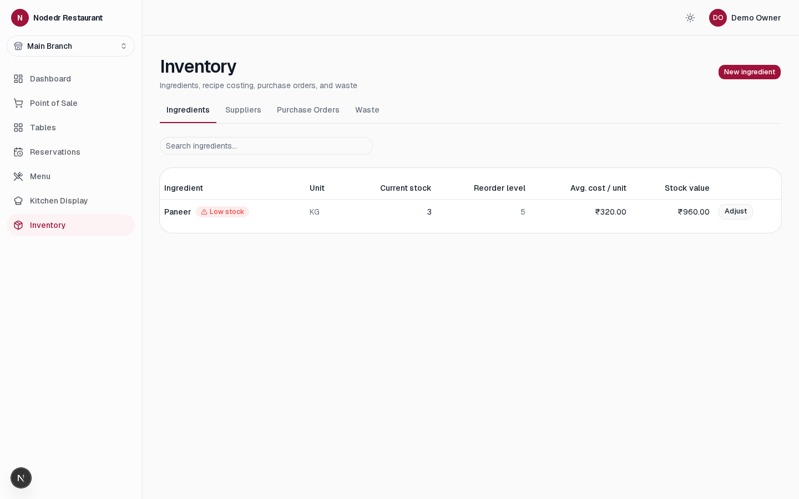
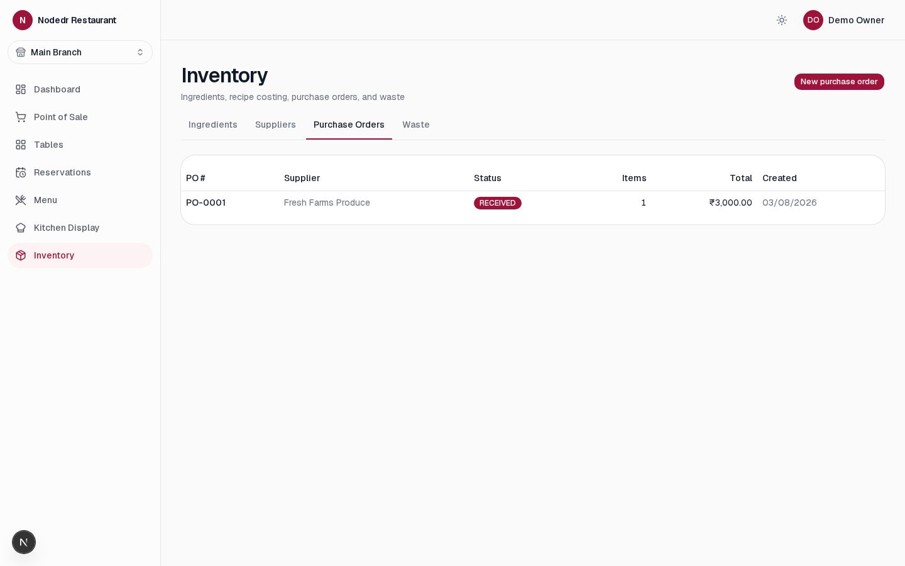

<div align="center">


**Offline-first Restaurant Management System** — POS, tables, kitchen
display, reservations, CRM/loyalty, and more.
Not a retail POS bolted onto a restaurant; purpose-built for dine-in,
takeaway, and kitchen operations.

[](./LICENSE)
[](package.json)
[](pnpm-workspace.yaml)
[](apps/web/tsconfig.json)
[](apps/backend)
[](apps/web)
[](casaos/README.md)
[](./CONTRIBUTING.md)
[](./ROADMAP.md)

Developed by [NodeDR Infotech Private Limited](https://www.nodedr.com/)

[Quick Start](#quick-start) ·
[Features](#features) ·
[Screenshots](#screenshots) ·
[Docs](#documentation) ·
[Contributing](#contributing) ·
[Roadmap](./ROADMAP.md)

</div>

---

## What this is

**Nodedr OrderRestro** is a purpose-built, offline-first Restaurant
Management System for restaurants, cafés, coffee shops, bakeries, fast
food, fine dining, bars, food courts, cloud kitchens, and multi-branch
chains. The whole stack — Postgres, API, and web app — runs on one local
server on the restaurant's own LAN: order-taking, billing, KDS, and
printing all keep working with the WAN cable unplugged. No subscription,
no forced cloud dependency, self-hosted by design.

It's a sister project to [`nodedr-pos`](https://github.com/Raktim94/nodedr-pos)
(the retail-shop POS), reusing its proven patterns — auth/session model,
receipt rendering, ESC/POS printing, currency-rounding discipline — but
built as its own codebase, because restaurant floor/kitchen/reservation
operations and retail shop billing are different enough domains that
forcing one schema to serve both would have compromised both. See
[`PROJECT.md`](./PROJECT.md) for the full rationale.

**Non-negotiable product principles** (the short version — full detail in
[`PROJECT.md`](./PROJECT.md)):

1. **Offline-first / self-hosted** — a single branch runs entirely on a
   local LAN server, zero internet dependency once installed.
2. **Premium, not "POS-ugly"** — every screen is held to the same bar as
   Stripe Dashboard, Linear, Notion, Vercel, Shopify Admin.
3. **RBAC everywhere** — every action gated by a granular, individually
   toggleable permission, never a hardcoded role check.
4. **Modular / plugin-ready** — 20 product domains that can evolve
   independently.
5. **Server-authoritative money** — all pricing, tax, discount, and
   loyalty math computed server-side, never trusted from the client.

## Where to run it

"Offline-first" describes how the app runs, not where it has to live —
nothing about it is tied to a specific machine or network:

- **A local LAN server (the default, recommended setup).** One machine in
  the restaurant runs `docker compose up`; every till, tablet, and KDS
  screen on the same Wi-Fi/Ethernet reaches it at `http://<that machine's
  LAN IP>:1995`. No internet connection is needed once it's running —
  order-taking, billing, KDS, and printing all keep working with the WAN
  cable unplugged.
- **Any VPS or cloud box.** The identical `docker compose up` also runs
  unmodified on a VPS (DigitalOcean, Hetzner, AWS, etc.) if you'd rather
  manage one restaurant — or several branches — remotely instead of on
  site. Point `FRONTEND_ORIGIN`/`HOST_PORT` in `.env` at that box instead
  of `localhost`; nothing else changes.
- **Behind a tunnel (Cloudflare Tunnel, ngrok, Tailscale Funnel, or any
  reverse proxy).** Reachable from outside the LAN with a real HTTPS
  certificate and no port-forwarding, by pointing the tunnel at the `web`
  service's port (`1995` by default). Once traffic reaches the app over
  `https://`, set **`COOKIE_SECURE=true`** in `.env` so the session cookie
  is marked `Secure` — leave it `false` (the default) for a plain
  `http://` LAN/VPS setup, since a browser silently refuses to store a
  `Secure` cookie on a non-HTTPS origin, which locks every user out with
  "Unauthorized" even though login appears to succeed.

Whichever way you reach it, it's the same three containers, same data, same
login — there's no separate "cloud" mode to configure.

- **CasaOS / ZimaOS.** Pre-built, multi-arch (amd64/arm64) images are
  published to GHCR and there's a ready-to-install app manifest — no build
  step, no `git clone` needed. Install directly from a compose URL today;
  see [`casaos/README.md`](casaos/README.md). Official app store submission
  pending.

### Windows desktop client

However you host the server above, tills that are Windows machines don't
have to use a browser tab: `windows/msix/` packages a thin native client
(WinForms + WebView2, not Electron — no bundled Chromium, no server, no
Docker) with a Start Menu entry that points at your server's address and
otherwise just shows the same web UI. See
[`windows/msix/README.md`](windows/msix/README.md) for what it is/isn't,
build instructions, and the full capability list.

Status: the build, package, install, and Start Menu registration are all
machine-verified on every push via GitHub Actions (`windows-msix.yml`,
real `windows-latest` runner) — not just "it compiled." What that CI run
does **not** cover: a physical Windows machine (Start Menu tile look,
taskbar icon, DPI scaling, upgrade-in-place), a real thermal printer, or
Microsoft Store certification (WACK) — see `windows/msix/README.md` and
[`SECURITY-AUDIT-REPORT.md`](./SECURITY-AUDIT-REPORT.md) for the full
verified-vs-not-tested breakdown before relying on it in production.

## Features

Full field-level detail for every module lives in [`ROADMAP.md`](./ROADMAP.md).
This is the complete 20-module scope from the original brief — **not**
all built yet; ✅ = done and verified end-to-end, 🚧 = planned, sequenced
by phase.

| | Module | Status |
|---|---|---|
| 1 | POS & Billing — dine-in/takeaway, split/merge bills, GST/VAT, discounts, gift cards, tips, multi-payment, refunds | ✅ |
| 2 | Table & Reservation Management — visual floor plan, booking, waitlist, QR table ordering, table transfer | ✅ |
| 3 | Kitchen Management (KDS) — display, KOTs, multi-station routing, prep tracking, performance reporting | ✅ |
| 4 | Menu Management — categories, modifier groups, combos, seasonal menus, availability scheduling | ✅ |
| 5 | Inventory & Store Management — ingredients, recipe costing, POs, suppliers, GRN, waste, batch/lot | ✅ |
| 6 | Procurement — vendor quotations, purchase requests/orders, invoices, supplier performance | 🚧 Phase 4 |
| 7 | CRM — profiles, loyalty points, memberships, gift vouchers, feedback, visit history | ✅ |
| 8 | Staff Management — records, attendance, shift scheduling, payroll, leave, tip distribution | ✅ staff accounts & roles · 🚧 rest, Phase 6 |
| 9 | Accounting — sales ledger, expenses, cash flow, P&L, GST reports, bank reconciliation | 🚧 Phase 6 |
| 10 | Delivery Management — executives, routing, tracking, 3rd-party integration | 🚧 Phase 5 |
| 11 | Online Ordering — website, mobile, QR, click & collect, scheduled orders | 🚧 Phase 5 |
| 12 | Branch Management — multi-outlet, centralized reporting/inventory, branch transfer | 🚧 Phase 6 |
| 13 | Analytics — sales dashboard, food cost, inventory valuation, peak hours, retention, margins | 🚧 Phase 7 |
| 14 | Marketing — coupons, promotions, happy hours, SMS/email/WhatsApp campaigns | 🚧 Phase 7 |
| 15 | Finance — daily cash closing, petty cash, expense approvals, budgets | 🚧 Phase 6 |
| 16 | Maintenance — equipment tracking, service schedules, requests, AMC | 🚧 Phase 7 |
| 17 | Documents — digital invoices, purchase docs, contracts, recipes, SOPs | 🚧 Phase 7 |
| 18 | Security — RBAC, audit logs, backup/restore, activity history, 2FA | ✅ RBAC · 🚧 rest, Phase 8 |
| 19 | Integrations — payment gateways, SMS, email, WhatsApp, accounting software, thermal printers | ✅ browser/USB-driver receipt printing, [API & MCP server](./docs/integrations-api.md) · 🚧 rest, Phase 8 |
| 20 | Admin Panel — global settings, taxes, currencies, business hours, feature flags | ✅ restaurant & branch settings · 🚧 rest, Phase 8 |

Already shipped and running against real Docker/Postgres today: auth +
RBAC, full menu management (incl. combo meals), floor/table view with
waitlist and merge, reservations, table QR codes with a public read-only
menu view, POS order-taking with modifiers, KOT generation routed to
kitchen stations (priority/reprint/performance reporting), a live Kitchen
Display Screen, billing + checkout (tips, split-bill calculator, gift
cards, loyalty points, refunds), customer CRM, a real-time dashboard, and
inventory & store management — ingredients, weighted-average recipe
costing, suppliers, purchase orders, goods receipts with batch/lot +
expiry tracking, FIFO waste logging, and automatic ingredient deduction
on checkout (combo-aware, never blocks a sale on a stock shortfall).
Also shipped: printable receipts (opens the browser's print dialog, same
"any printer, or Save as PDF" approach as [`nodedr-pos`](https://github.com/Raktim94/nodedr-pos)),
a Settings area (restaurant + branch details) and staff account
management (create/deactivate staff, assign roles) under **Settings** in
the sidebar, and photo upload on menu items.

## Screenshots

| | |
|---|---|
|  |  |
| Dashboard — light | Dashboard — dark |
|  |  |
| Point of Sale | Kitchen Display — priority ticket, live timers |
|  |  |
| Tables — floor view + waitlist | Reservations |
|  |  |
| Customers — CRM + loyalty | Menu management — combo builder |
|  |  |
| Inventory — ingredients, low-stock, weighted-average cost | Purchase orders — supplier, status, total |

<details>
<summary>Mobile (390px)</summary>


</details>

## Tech stack

NestJS (API) + PostgreSQL/Prisma + Next.js (web) + Socket.IO (realtime) in
a pnpm/Turborepo monorepo. Full rationale for every choice — including why
NestJS over the plain-Express pattern its sister project uses, and why
Postgres over the originally-specced SQLite — is in
[`ARCHITECTURE.md`](./ARCHITECTURE.md).

| Layer | Choice |
|---|---|
| Monorepo | pnpm workspaces + Turborepo |
| Backend | NestJS (TypeScript), REST `/api/v1`, Swagger at `/api/docs` |
| ORM / DB | Prisma + PostgreSQL |
| Realtime | Socket.IO (NestJS gateway) — tables, KDS tickets, QR-order status |
| Frontend | Next.js (App Router) + TypeScript + Tailwind v4 |
| UI components | shadcn/ui (Base UI primitives), owned source, not a black-box dep |
| Data fetching | TanStack Query |
| Forms | React Hook Form + Zod (schemas shared with the backend via `packages/types`) |
| Tables | TanStack Table |
| Charts | Recharts |
| Drag & drop | dnd-kit (floor designer, KDS columns) |
| i18n | next-intl |
| Auth | JWT (httpOnly cookie) + PIN quick-switch, optional TOTP 2FA |
| Containers | Docker + Docker Compose |

## Quick start

### Installing Docker

Skip this if `docker --version` already works. Otherwise, pick your OS:

**Linux** (Debian/Ubuntu/Fedora/etc. — official convenience script):

```bash
curl -fsSL https://get.docker.com | sudo sh && sudo usermod -aG docker $USER
```

Log out and back in (or run `newgrp docker`) so your user can run `docker`
without `sudo`.

**macOS** (via [Homebrew](https://brew.sh)):

```bash
brew install --cask docker
```

Then open the Docker.app once from Launchpad/Spotlight to finish setup and
start the Docker engine — it needs to be running before `docker compose`
works.

**Windows 10/11** (via [winget](https://learn.microsoft.com/windows/package-manager/winget/), bundled with current Windows):

```powershell
winget install Docker.DockerDesktop
```

Reboot if prompted, accept the WSL2 backend if asked, then launch Docker
Desktop once from the Start menu. Run the install steps below from **WSL2**
or **Git Bash** (both include the `bash` this project's install script
needs) — plain PowerShell/cmd can't run a `.sh` file directly.

No hand-holding needed beyond that — all three ship Docker Compose v2
already bundled, which is all this project requires.

### One-click install

```bash
git clone https://github.com/Raktim94/nodedr-restaurant-pos.git && cd nodedr-restaurant-pos && ./install.sh
```

[`install.sh`](install.sh) generates a `.env` with random secrets (only if
one doesn't already exist — safe to re-run), builds the backend + web Docker
images, starts the stack, and waits for the backend to report healthy. Re-run
it any time after `git pull` to rebuild.

Open **http://localhost:1995** and create your restaurant at `/signup` — no
demo data is loaded by default. To try the app with sample data instead, run
`./install.sh --demo` and sign in with `owner@demo.local` / `Password123!`.

The backend API and Swagger docs are reachable only through the web app's
`/api` proxy, not published directly to the host.

### Manual install

If you'd rather run each step yourself (e.g. to set your own secrets instead
of generated ones):

```bash
git clone https://github.com/Raktim94/nodedr-restaurant-pos.git
cd nodedr-restaurant-pos
cp .env.example .env        # edit JWT_SECRET / POSTGRES_PASSWORD for anything beyond local dev
docker compose up -d --build
docker exec nodedr-restaurant-backend npx ts-node prisma/seed.ts   # optional: demo data + login; upsert-based, safe to re-run
```

### Local dev (no Docker for the apps)

Requires Node 22+, pnpm, and a local Postgres (or just run the `postgres`
service from Docker Compose).

```bash
pnpm install
docker compose up -d postgres
cp apps/backend/.env.example apps/backend/.env   # point DATABASE_URL at your Postgres
pnpm --filter @nodedr-restaurant/types build
cd apps/backend && npx prisma migrate dev && npx ts-node prisma/seed.ts && cd ../..
pnpm dev   # runs backend (:4001) and web (:1995) together via Turborepo
```

Full setup detail, coding conventions, and the PR process are in
[`CONTRIBUTING.md`](./CONTRIBUTING.md).

### Updating

**Docker install (one-click or manual):**

```bash
git pull
./install.sh
```

Re-running [`install.sh`](install.sh) is safe any time — it never overwrites
an existing `.env` or touches existing data. It rebuilds the backend + web
images and restarts the stack; the backend runs `prisma migrate deploy`
automatically on startup, so any new database migrations from the pull are
applied before it starts accepting traffic. If you installed manually
instead, the equivalent is:

```bash
git pull
docker compose up -d --build
```

**Local dev (no Docker for the apps):**

```bash
git pull
pnpm install
pnpm --filter @nodedr-restaurant/types build
cd apps/backend && npx prisma migrate dev && cd ../..
pnpm dev
```

## Monorepo layout

```
apps/backend    NestJS API (REST /api/v1, Swagger at /api/docs, Socket.IO)
apps/web        Next.js — back-office, POS, KDS, public QR menu view
packages/types  Shared Zod schemas / TS types used by both apps
casaos/         CasaOS/ZimaOS app store manifest + assets — see casaos/README.md
docs/           Screenshots and supplementary docs
```

## Documentation

| Doc | What's in it |
|---|---|
| [`PROJECT.md`](./PROJECT.md) | Source of truth — full vision, non-negotiable principles, complete 20-module scope, current status |
| [`ARCHITECTURE.md`](./ARCHITECTURE.md) | Tech-stack decisions and the reasoning behind each one |
| [`ROADMAP.md`](./ROADMAP.md) | Phased build plan / living TODO — checkboxes are the real status |
| [`DESIGN_SYSTEM.md`](./DESIGN_SYSTEM.md) | Visual language, tokens, type scale, component inventory, per-surface UX notes |
| [`casaos/README.md`](./casaos/README.md) | CasaOS/ZimaOS one-click install, image publishing, official app store submission steps |
| [`windows/msix/README.md`](./windows/msix/README.md) | Windows MSIX desktop client — what it is/isn't, build/validate instructions, capabilities, what's CI-verified vs. not tested on real hardware |
| [`ACCESSIBILITY.md`](./ACCESSIBILITY.md) | WCAG 2.1 AA target, what's implemented, testing methodology, known gaps |
| [`COMPLIANCE-INDIA.md`](./COMPLIANCE-INDIA.md) | How the architecture relates to the DPDP Act 2023, IT Rules, GST invoicing, and CCPA dark-patterns guidelines |
| [`SECURITY-AUDIT-REPORT.md`](./SECURITY-AUDIT-REPORT.md) | Full Critical/High/Medium/Low security audit findings + fixes, and Windows/MSIX Store-readiness status (what's verified vs. not tested) |
| [`docs/integrations-api.md`](./docs/integrations-api.md) | MCP server (for AI clients) and the public integration REST API (for an external website's backend) — auth, endpoints, examples |

## Development notes

- **Server-authoritative pricing** — menu prices are tax-inclusive; GST/VAT
  is backed out, never added on top. See
  `apps/backend/src/modules/orders/pricing.ts`.
- **Money balances are `set`, never `increment`** — any running balance
  (loyalty points, gift card balance, wallet credit) is updated via a
  rounded read-modify-write `set`; DB-side `increment` drifts on Float
  columns over many transactions.
- **Shared validation** — Zod schemas in `packages/types` drive both the
  NestJS `ZodValidationPipe` and the frontend's `react-hook-form`
  resolvers: one schema per DTO, never duplicated.
- **Realtime** — `RealtimeGateway` (Socket.IO) pushes KOT/table/order
  events into a per-branch room; the frontend's `useRealtime` hook
  invalidates the matching TanStack Query caches instead of polling.
- **Inventory costing is weighted-average**, recomputed on every goods
  receipt; waste is drawn FIFO from the oldest stock batch first, so
  cost-of-waste reporting reflects the batch that actually spoiled, not a
  blended average. See
  `apps/backend/src/modules/inventory/goods-receipts.service.ts` and
  `waste.service.ts`.
- **Order checkout deducts ingredient stock but never blocks a sale on it**
  — `StockService.consumeStock(..., allowNegative: true)` lets stock go
  negative rather than fail a paid order over a recipe-modeling gap; waste
  logging uses the same function with `allowNegative: false`, since it has
  no such urgency. See `apps/backend/src/modules/inventory/stock.service.ts`.

## Contributing

Contributions are very welcome — this is early-stage with a lot of open
scope (see the feature table above). Start with
**[`CONTRIBUTING.md`](./CONTRIBUTING.md)**: environment setup, the
non-negotiable conventions (money rounding, RBAC, shared schemas,
realtime), commit/PR process, and how to propose bigger architecture
changes without silently re-litigating a decision already recorded in
`PROJECT.md`/`ARCHITECTURE.md`.

This project follows the [Contributor Covenant](./CODE_OF_CONDUCT.md).

## License

Copyright © 2026 [Nodedr Infotech Private Limited](https://www.nodedr.com/)
and Raktim Ranjit. Licensed under the
[GNU Affero General Public License v3.0](./LICENSE) (AGPL-3.0). In short:
you're free to self-host, use, and modify this software for your
restaurant or business. If you modify it and run that modified version
as a network service for others, you must make your modified source
available to those users under the same license — this keeps
improvements to a self-hosted business tool in the open rather than
disappearing into a closed commercial fork.

See [`MAINTAINERS.md`](./MAINTAINERS.md) for project maintainers.

---

<div align="center">

</div>
