<div align="center">

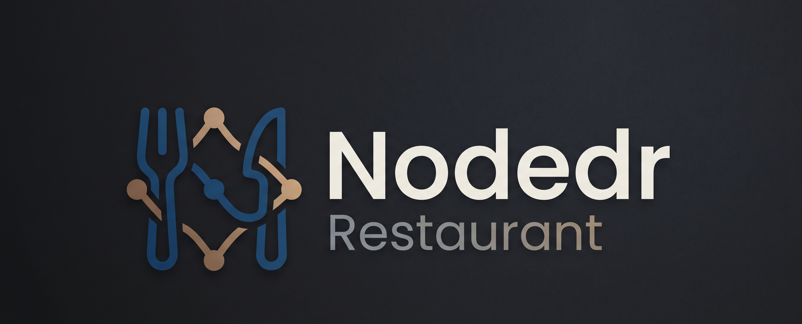

**Offline-first Restaurant Management System** — POS, tables, kitchen
display, reservations, CRM/loyalty, and more.
Not a retail POS bolted onto a restaurant; purpose-built for dine-in,
takeaway, and kitchen operations.

[](./LICENSE)
[](package.json)
[](pnpm-workspace.yaml)
[](apps/web/tsconfig.json)
[](apps/backend)
[](apps/web)
[](./CONTRIBUTING.md)
[](./ROADMAP.md)

[Quick Start](#quick-start) ·
[Features](#features) ·
[Screenshots](#screenshots) ·
[Docs](#documentation) ·
[Contributing](#contributing) ·
[Roadmap](./ROADMAP.md)

</div>

---

## What this is

**Nodedr Restaurant** is a purpose-built, offline-first Restaurant
Management System for restaurants, cafés, coffee shops, bakeries, fast
food, fine dining, bars, food courts, cloud kitchens, and multi-branch
chains. The whole stack — Postgres, API, and web app — runs on one local
server on the restaurant's own LAN: order-taking, billing, KDS, and
printing all keep working with the WAN cable unplugged. No subscription,
no forced cloud dependency, self-hosted by design.

It's a sister project to [`nodedr-pos`](https://github.com/Raktim94/nodedr-pos)
(the retail-shop POS), reusing its proven patterns — auth/session model,
receipt rendering, ESC/POS printing, currency-rounding discipline — but
built as its own codebase, because restaurant floor/kitchen/reservation
operations and retail shop billing are different enough domains that
forcing one schema to serve both would have compromised both. See
[`PROJECT.md`](./PROJECT.md) for the full rationale.

**Non-negotiable product principles** (the short version — full detail in
[`PROJECT.md`](./PROJECT.md)):

1. **Offline-first / self-hosted** — a single branch runs entirely on a
   local LAN server, zero internet dependency once installed.
2. **Premium, not "POS-ugly"** — every screen is held to the same bar as
   Stripe Dashboard, Linear, Notion, Vercel, Shopify Admin.
3. **RBAC everywhere** — every action gated by a granular, individually
   toggleable permission, never a hardcoded role check.
4. **Modular / plugin-ready** — 20 product domains that can evolve
   independently.
5. **Server-authoritative money** — all pricing, tax, discount, and
   loyalty math computed server-side, never trusted from the client.

## Features

Full field-level detail for every module lives in [`ROADMAP.md`](./ROADMAP.md).
This is the complete 20-module scope from the original brief — **not**
all built yet; ✅ = done and verified end-to-end, 🚧 = planned, sequenced
by phase.

| | Module | Status |
|---|---|---|
| 1 | POS & Billing — dine-in/takeaway, split/merge bills, GST/VAT, discounts, gift cards, tips, multi-payment, refunds | ✅ |
| 2 | Table & Reservation Management — visual floor plan, booking, waitlist, QR table ordering, table transfer | ✅ |
| 3 | Kitchen Management (KDS) — display, KOTs, multi-station routing, prep tracking, performance reporting | ✅ |
| 4 | Menu Management — categories, modifier groups, combos, seasonal menus, availability scheduling | ✅ |
| 5 | Inventory & Store Management — ingredients, recipe costing, POs, suppliers, GRN, waste, batch/lot | 🚧 Phase 4 |
| 6 | Procurement — vendor quotations, purchase requests/orders, invoices, supplier performance | 🚧 Phase 4 |
| 7 | CRM — profiles, loyalty points, memberships, gift vouchers, feedback, visit history | ✅ |
| 8 | Staff Management — records, attendance, shift scheduling, payroll, leave, tip distribution | 🚧 Phase 6 |
| 9 | Accounting — sales ledger, expenses, cash flow, P&L, GST reports, bank reconciliation | 🚧 Phase 6 |
| 10 | Delivery Management — executives, routing, tracking, 3rd-party integration | 🚧 Phase 5 |
| 11 | Online Ordering — website, mobile, QR, click & collect, scheduled orders | 🚧 Phase 5 |
| 12 | Branch Management — multi-outlet, centralized reporting/inventory, branch transfer | 🚧 Phase 6 |
| 13 | Analytics — sales dashboard, food cost, inventory valuation, peak hours, retention, margins | 🚧 Phase 7 |
| 14 | Marketing — coupons, promotions, happy hours, SMS/email/WhatsApp campaigns | 🚧 Phase 7 |
| 15 | Finance — daily cash closing, petty cash, expense approvals, budgets | 🚧 Phase 6 |
| 16 | Maintenance — equipment tracking, service schedules, requests, AMC | 🚧 Phase 7 |
| 17 | Documents — digital invoices, purchase docs, contracts, recipes, SOPs | 🚧 Phase 7 |
| 18 | Security — RBAC, audit logs, backup/restore, activity history, 2FA | ✅ RBAC · 🚧 rest, Phase 8 |
| 19 | Integrations — payment gateways, SMS, email, WhatsApp, accounting software, thermal printers | 🚧 Phase 8 |
| 20 | Admin Panel — global settings, taxes, currencies, business hours, feature flags | 🚧 Phase 8 |

Already shipped and running against real Docker/Postgres today: auth +
RBAC, full menu management (incl. combo meals), floor/table view with
waitlist and merge, reservations, table QR codes with a public read-only
menu view, POS order-taking with modifiers, KOT generation routed to
kitchen stations (priority/reprint/performance reporting), a live Kitchen
Display Screen, billing + checkout (tips, split-bill calculator, gift
cards, loyalty points, refunds), customer CRM, and a real-time dashboard.

## Screenshots

| | |
|---|---|
| 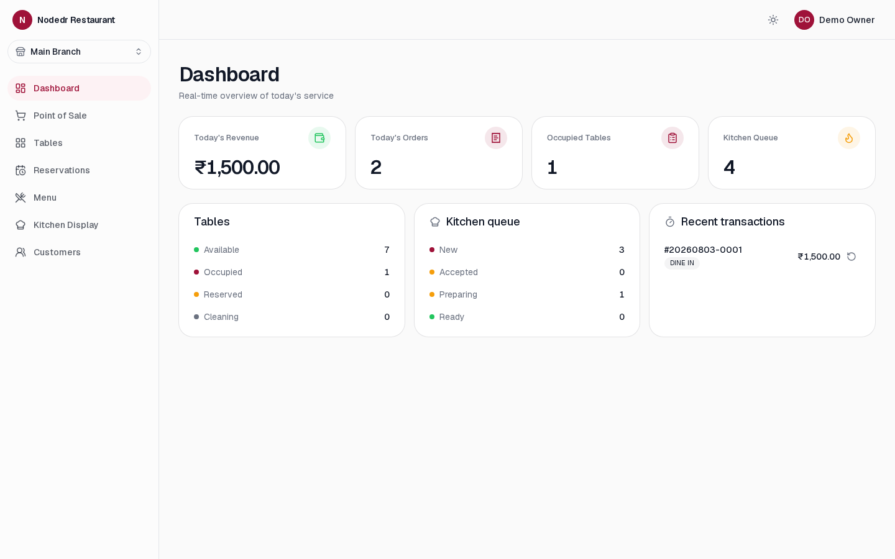 | 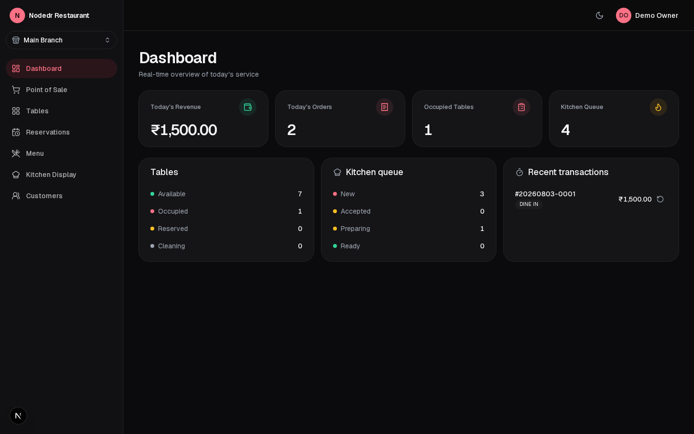 |
| Dashboard — light | Dashboard — dark |
| 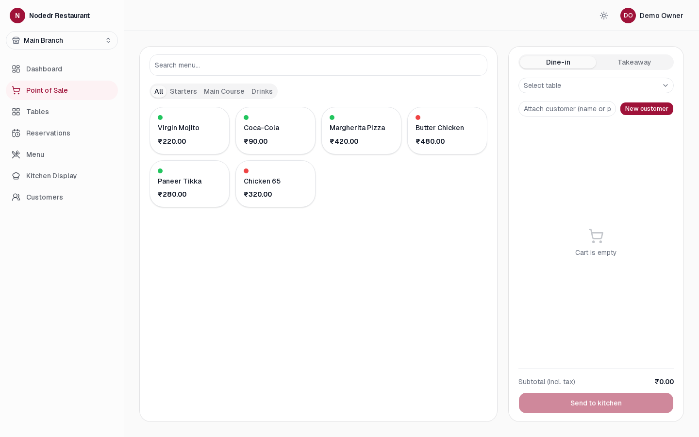 | 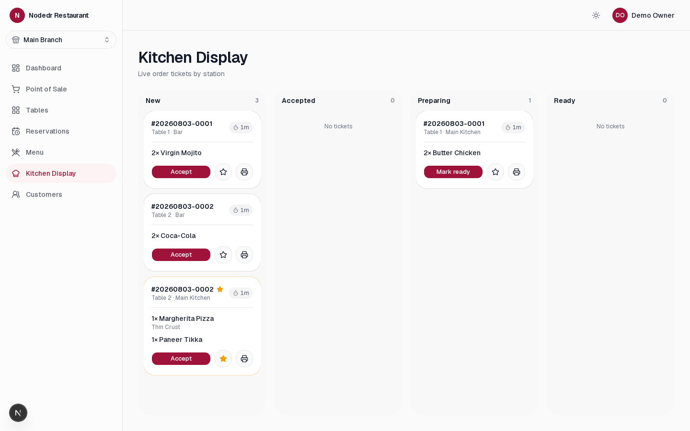 |
| Point of Sale | Kitchen Display — priority ticket, live timers |
| 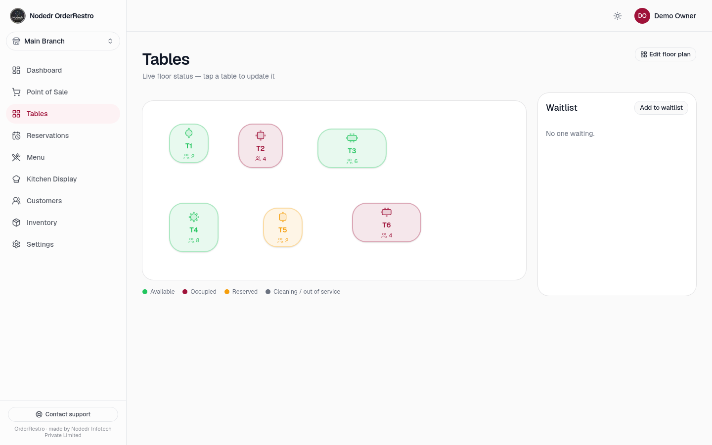 | 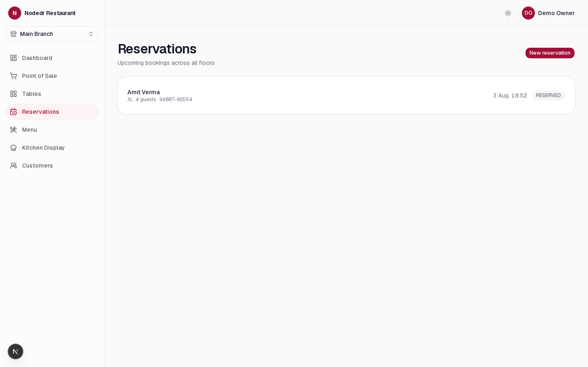 |
| Tables — floor view + waitlist | Reservations |
| 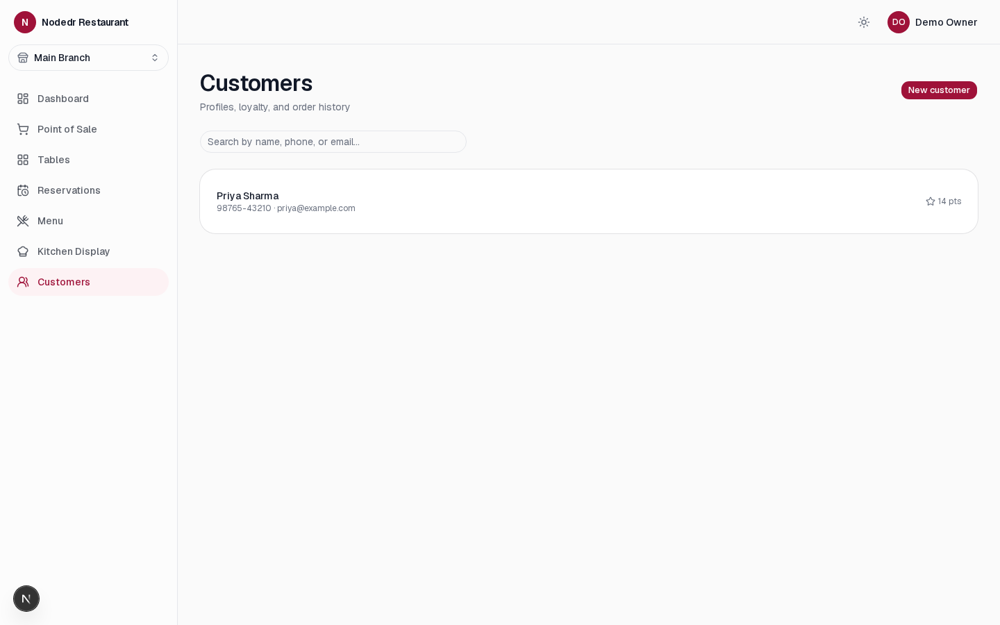 | 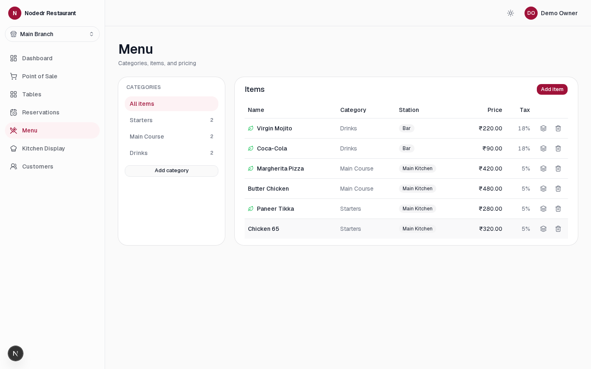 |
| Customers — CRM + loyalty | Menu management — combo builder |

<details>
<summary>Mobile (390px)</summary>

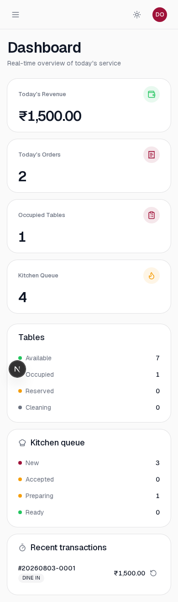

</details>

## Tech stack

NestJS (API) + PostgreSQL/Prisma + Next.js (web) + Socket.IO (realtime) in
a pnpm/Turborepo monorepo. Full rationale for every choice — including why
NestJS over the plain-Express pattern its sister project uses, and why
Postgres over the originally-specced SQLite — is in
[`ARCHITECTURE.md`](./ARCHITECTURE.md).

| Layer | Choice |
|---|---|
| Monorepo | pnpm workspaces + Turborepo |
| Backend | NestJS (TypeScript), REST `/api/v1`, Swagger at `/api/docs` |
| ORM / DB | Prisma + PostgreSQL |
| Realtime | Socket.IO (NestJS gateway) — tables, KDS tickets, QR-order status |
| Frontend | Next.js (App Router) + TypeScript + Tailwind v4 |
| UI components | shadcn/ui (Base UI primitives), owned source, not a black-box dep |
| Data fetching | TanStack Query |
| Forms | React Hook Form + Zod (schemas shared with the backend via `packages/types`) |
| Tables | TanStack Table |
| Charts | Recharts |
| Drag & drop | dnd-kit (floor designer, KDS columns) |
| i18n | next-intl |
| Auth | JWT (httpOnly cookie) + PIN quick-switch, optional TOTP 2FA |
| Containers | Docker + Docker Compose |

## Quick start

### Docker (recommended)

```bash
git clone https://github.com/Raktim94/nodedr-restaurant-pos.git
cd nodedr-restaurant-pos
cp .env.example .env        # edit JWT_SECRET / POSTGRES_PASSWORD for anything beyond local dev
docker compose up -d --build
docker exec nodedr-restaurant-backend npx ts-node prisma/seed.ts   # first run only — demo data + login
```

Open **http://localhost:1995** and sign in with `owner@demo.local` /
`Password123!` (seeded demo account — change or remove before real use).

The backend API and Swagger docs are reachable only through the web app's
`/api` proxy, not published directly to the host.

### Local dev (no Docker for the apps)

Requires Node 22+, pnpm, and a local Postgres (or just run the `postgres`
service from Docker Compose).

```bash
pnpm install
docker compose up -d postgres
cp apps/backend/.env.example apps/backend/.env   # point DATABASE_URL at your Postgres
pnpm --filter @nodedr-restaurant/types build
cd apps/backend && npx prisma migrate dev && npx ts-node prisma/seed.ts && cd ../..
pnpm dev   # runs backend (:4001) and web (:1995) together via Turborepo
```

Full setup detail, coding conventions, and the PR process are in
[`CONTRIBUTING.md`](./CONTRIBUTING.md).

## Monorepo layout

```
apps/backend    NestJS API (REST /api/v1, Swagger at /api/docs, Socket.IO)
apps/web        Next.js — back-office, POS, KDS, public QR menu view
packages/types  Shared Zod schemas / TS types used by both apps
docs/           Screenshots and supplementary docs
```

## Documentation

| Doc | What's in it |
|---|---|
| [`PROJECT.md`](./PROJECT.md) | Source of truth — full vision, non-negotiable principles, complete 20-module scope, current status |
| [`ARCHITECTURE.md`](./ARCHITECTURE.md) | Tech-stack decisions and the reasoning behind each one |
| [`ROADMAP.md`](./ROADMAP.md) | Phased build plan / living TODO — checkboxes are the real status |
| [`DESIGN_SYSTEM.md`](./DESIGN_SYSTEM.md) | Visual language, tokens, type scale, component inventory, per-surface UX notes |

## Development notes

- **Server-authoritative pricing** — menu prices are tax-inclusive; GST/VAT
  is backed out, never added on top. See
  `apps/backend/src/modules/orders/pricing.ts`.
- **Money balances are `set`, never `increment`** — any running balance
  (loyalty points, gift card balance, wallet credit) is updated via a
  rounded read-modify-write `set`; DB-side `increment` drifts on Float
  columns over many transactions.
- **Shared validation** — Zod schemas in `packages/types` drive both the
  NestJS `ZodValidationPipe` and the frontend's `react-hook-form`
  resolvers: one schema per DTO, never duplicated.
- **Realtime** — `RealtimeGateway` (Socket.IO) pushes KOT/table/order
  events into a per-branch room; the frontend's `useRealtime` hook
  invalidates the matching TanStack Query caches instead of polling.

## Contributing

Contributions are very welcome — this is early-stage with a lot of open
scope (see the feature table above). Start with
**[`CONTRIBUTING.md`](./CONTRIBUTING.md)**: environment setup, the
non-negotiable conventions (money rounding, RBAC, shared schemas,
realtime), commit/PR process, and how to propose bigger architecture
changes without silently re-litigating a decision already recorded in
`PROJECT.md`/`ARCHITECTURE.md`.

This project follows the [Contributor Covenant](./CODE_OF_CONDUCT.md).

## License

Licensed under the [GNU Affero General Public License v3.0](./LICENSE)
(AGPL-3.0). In short: you're free to self-host, use, and modify this
software for your restaurant or business. If you modify it and run that
modified version as a network service for others, you must make your
modified source available to those users under the same license — this
keeps improvements to a self-hosted business tool in the open rather than
disappearing into a closed commercial fork.

---

<div align="center">
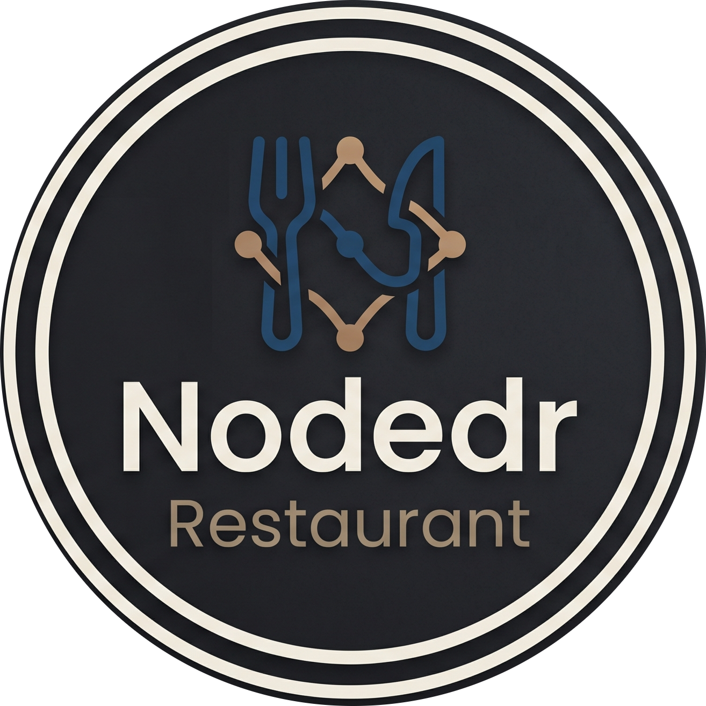
</div>
